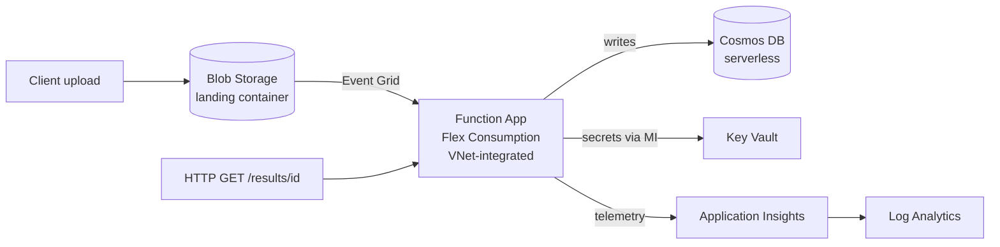

<!--
  docs/architecture.md — The "why" behind the design.
  Purpose: capture architectural decisions, trade-offs, and the system diagram so a reviewer
  (or future you) understands not just what was built but why each choice was made. This is
  where you defend design decisions in an interview.
  STATUS: scaffold — decisions are stubbed with TODO notes to fill in as you build.
-->

# Architecture & Design Decisions

## System diagram

## Key decisions

| Decision | Choice | Why | Trade-off |
|----------|--------|-----|-----------|
| Compute | Azure Functions **Flex Consumption** | True serverless + VNet integration + instance memory sizing | Newer plan; some provider quirks (see runbook) |
| IaC | **Terraform** w/ reusable modules | Portable, industry-standard, strong resume signal | More boilerplate than Bicep for pure-Azure shops |
| State | **azurerm remote backend** + locking | Team-safe, no local state | Requires bootstrap step |
| CI auth | **OIDC federation** (no secrets) | No long-lived credentials to leak/rotate | One-time federated-credential setup |
| Data store | **Cosmos DB serverless** | Pay-per-RU, scales to zero-ish, cheap for bursty | Not ideal for sustained high throughput |
| Identity | **Managed identity + RBAC** | No connection strings/keys anywhere | Requires User Access Administrator at deploy |

<!-- TODO(milestone 8): expand each decision with the real config you landed on -->

## Environment profiles

- **dev** — cost-optimized: service endpoints instead of private endpoints, no always-on
  resources. Safe to `destroy` between demos.
- **prod** — security-optimized: full private endpoints, tighter NSGs, private DNS zones.

## Network design

<!-- TODO(milestone 2/5): document VNet CIDR, subnet delegation, private DNS zones -->

## Security model

<!-- TODO(milestone 4/5): document the managed-identity RBAC role assignments and Key Vault access -->
